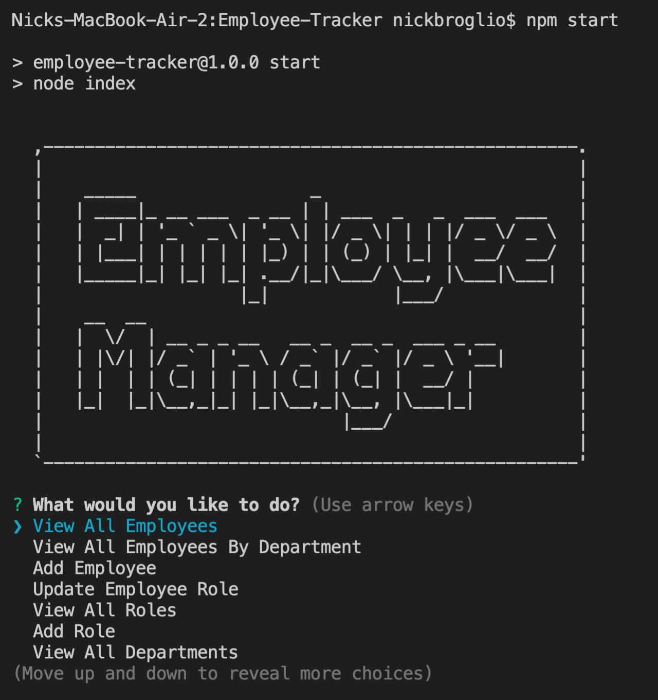
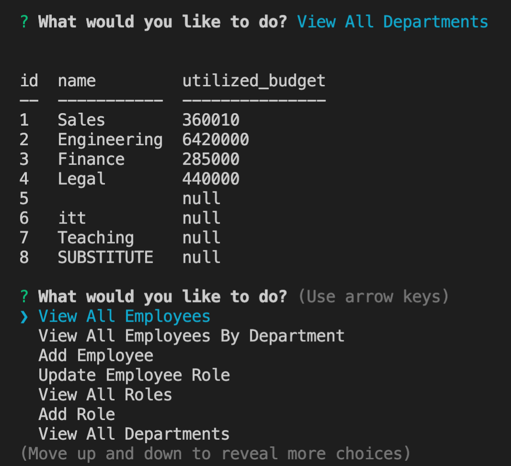
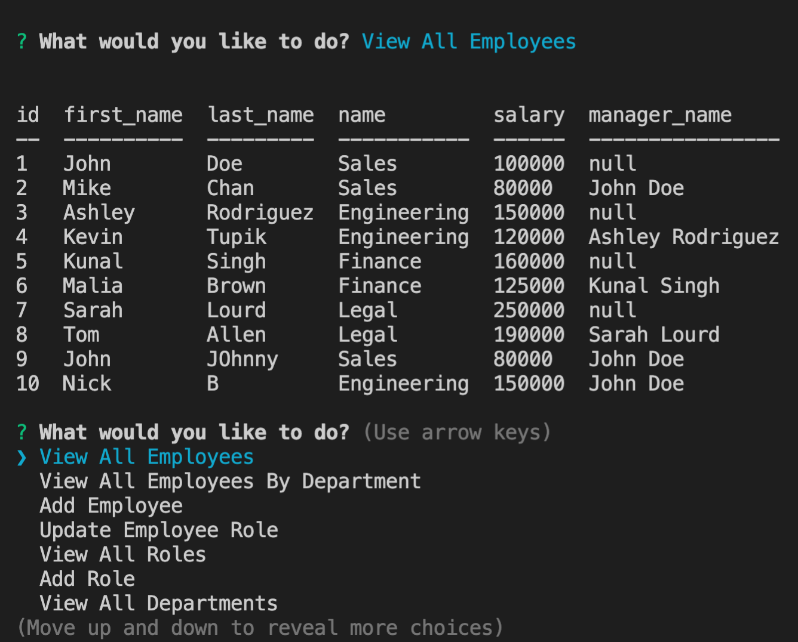
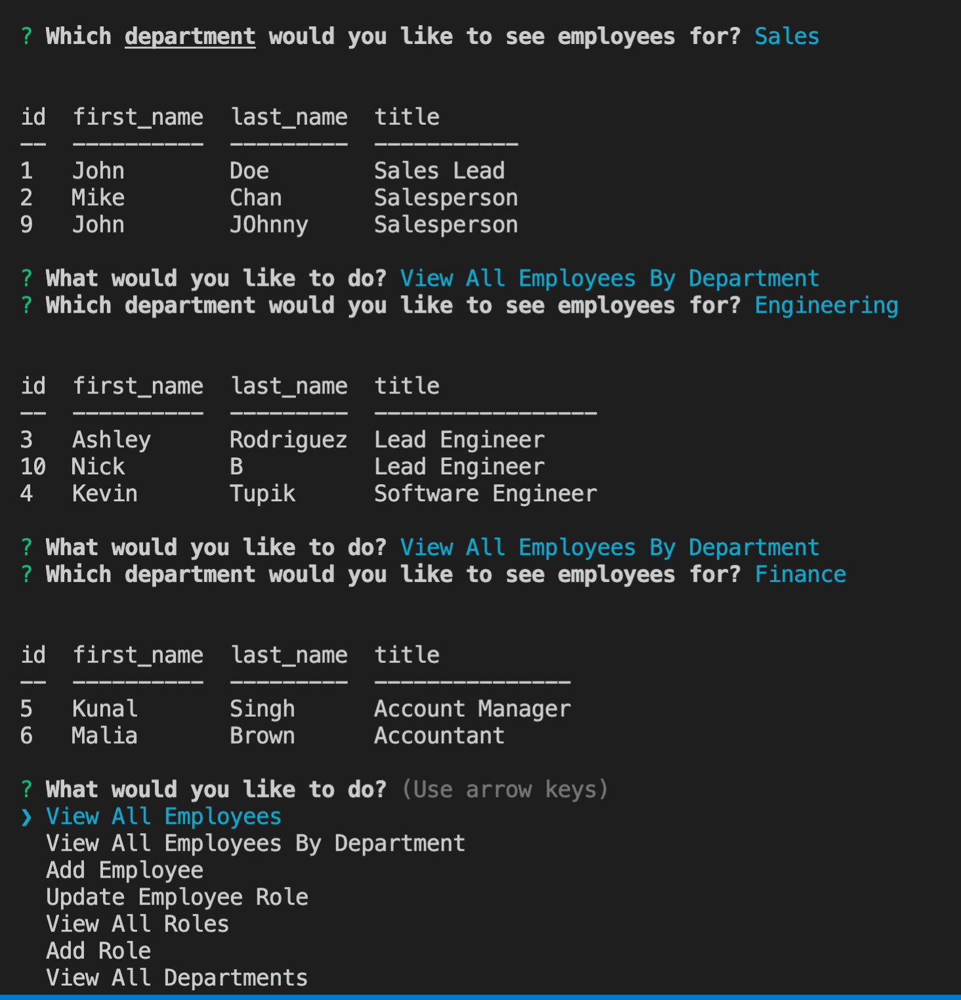
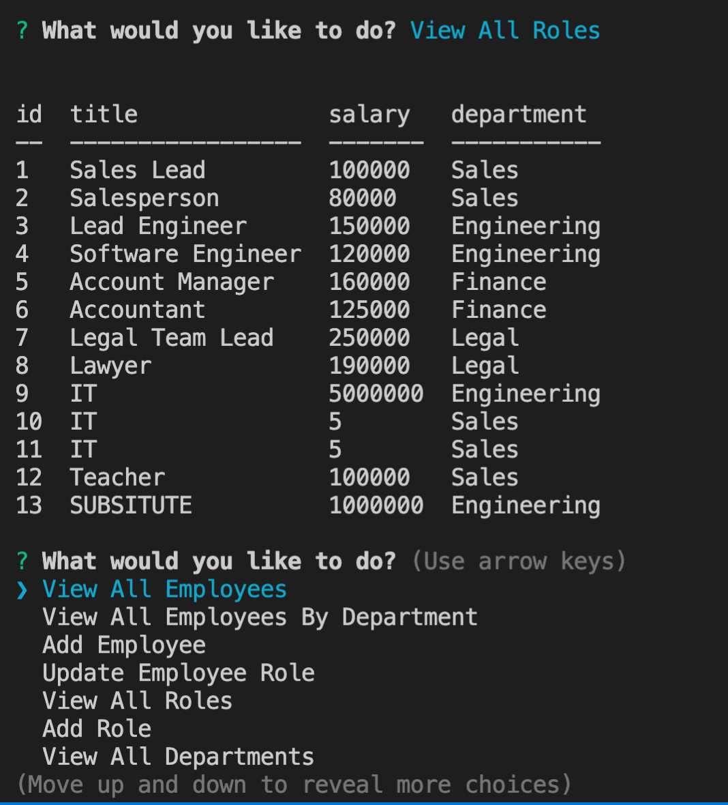

# Employee Tracker

## Description
When the server is ran, the list of options is show for a user to choose.
When a user chooses a prompt, the internal function runs and either a new promt appears or a database appears.

## Video Link
[Walkthrough Video Link](https://www.youtube.com/watch?v=kUQaRxadVmg)

## Installation

## Usage 

When a user selects view all departments a table of the departments appears.

When a user selects view all emloyees a table of employees appears.

When a user selects view employee by department, a table of employees by department appears.

When a user selects view all roles, a table of all the roles appears.

## Questions 
* Github: NickBroglio 

* Email: nickrbroglio@gmail.com